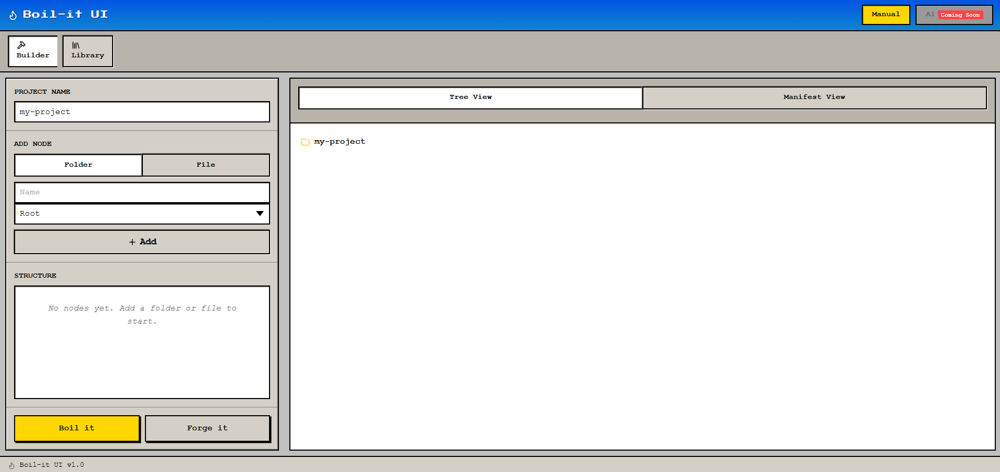
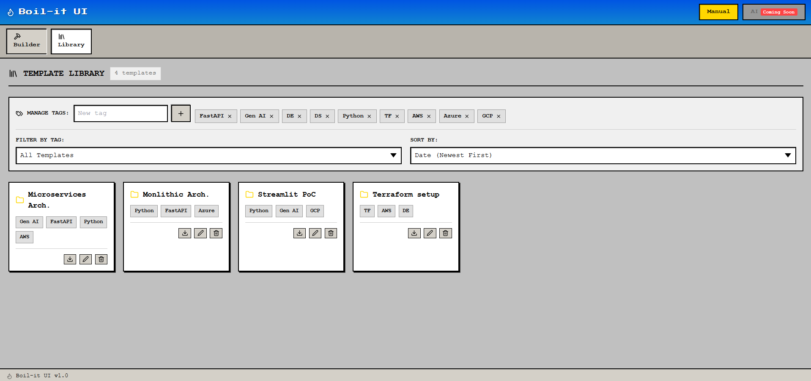

# Boil It UI

Thanks for watching 👋  
Follow the guide below to run it on your local.

---

## What is Boil It?

**Boil It UI** is a time-saving, local-first application that allows developers to:

- Create project scaffolds visually
- Save them as reusable templates
- Reuse them across projects without copy-pasting old repos

Instead of redefining folder structures every time, you **forge once and reuse forever**.

---

## UI Philosophy

The UI is intentionally **simple and opinionated**, inspired by **early 2000s desktop tools**.

- No heavy animations  
- No over-engineered flows  
- Just structure → preview → generate  

---

## Screenshots

Template Builder  


Preview & Manifest View  


---

## How It Works

1. **Define a scaffold**
   - Add folders and files using the tree controller
   - Nest structures easily by selecting parent nodes

2. **Preview instantly**
   - Tree view shows the final folder structure
   - Manifest view shows the underlying config
   - Warnings appear if something looks off

3. **Forge the template**
   - Save the scaffold into your local template library

4. **Boil it**
   - Generate the scaffold anywhere by selecting a target path
   - Open the generated project directly in VS Code

Everything runs **locally**.  
No cloud. No login. No vendor lock-in.

---

## Running Locally (Recommended)

### Prerequisites

- Python 3.10+
- Node.js 18+
- npm
- VS Code (optional)

---

### Clone the repo

```bash
git clone https://github.com/anubhavgirdhar1/boil-it-ui.git
cd boil-it-ui
````

---

### Run Backend (FastAPI)

```bash
cd backend/app
pip install -r requirements.txt
uvicorn main:app --reload --port 3000
```

Backend runs at:
[http://localhost:3000](http://localhost:3000)

---

### Run Frontend (Vite + React)

```bash
cd frontend
npm install
npm run dev
```

Frontend runs at:
[http://localhost:5173](http://localhost:5173)

---

### One-command run (Windows)

```powershell
./run_local.ps1
```

---

## Docker Support (Limitation)

Docker support exists **only for demo purposes**.

⚠️ OS-level features like:

* Opening folders
* Launching VS Code

will **not work inside Docker** due to container isolation.

👉 For full functionality, running locally is recommended.

---

## Why Local-First?

* Faster iteration
* No network dependency
* Full filesystem access
* Works offline
* Safer for internal tooling

---

## Author

Built by **Anubhav Girdhar**

Happy boiling 🫖

```

